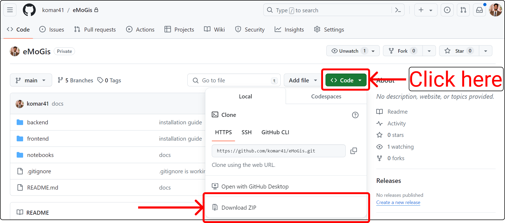

<TODO- Intro. Add image of the system.>

# VIGMA: The Visual Gait and Motion Analytics Framework

This project, VIGMA, is designed to visualize and analyze gait data, providing a comprehensive tool for understanding mobility and balance in various patient populations. VIGMA integrates data processing, analysis, and visualization within a user-friendly framework, making it accessible to researchers, clinicians, and practitioners. The system supports the exploration of disease progression, comparisons across multiple patient groups, and offers advanced visual analytics capabilities. Our goal is to facilitate deeper insights into gait disorders and aid in the development of tailored treatment plans and rehabilitation strategies. VIGMA is open-source and available for use and contribution at [github.com/komar41/VIGMA](https://github.com/komar41/VIGMA).

For a complete description of the framework, please check our paper:

**VIGMA: An Open-Access Framework for Visual Gait and Motion Analytics**  
*Kazi Shahrukh Omar, Shuaijie Wang, Ridhuparan Kungumaraju, Tanvi Bhatt, Fabio Miranda*  
IEEE Transactions on Visualization and Computer Graphics (To appear)  
Paper: [[DOI](https://doi.org/10.1109/TVCG.2025.3564866)], [[Arxiv](https://arxiv.org/abs/2504.17960)]


<div align="center">
    <b>The VIGMA Framework</b>
</div>

## Table of Contents

- [Demonstration](#demonstration)
- [Installation Guide](#installation-guide)
  - [Installing via Docker](#installing-via-docker)
  - [Installing Manually](#installing-manually)
    - [Project Setup](#project-setup)
    - [Run the Application](#run-the-application)
- [Using the Python API](#using-the-python-api)
- [Replicating the Results](#replicating-the-results)
- [License](#license)

## Demonstration

<div align="center">
  <video src="https://github.com/user-attachments/assets/3d27c1e4-751d-4ed6-83ad-fb3aba6d9491" />
</div>


## Installation Guide

This guide provides detailed steps to install and set up the VIGMA system, including software installations, project setup, and running the application. You can install VIGMA using Docker, which will handle the orchestration of all required servers automatically, or install each component manually for more control and customization.

**⚠️ Important: Place all gait data files in the ``backend/data/`` directory. In VIGMA's interface, reference them with paths relative to the root of the cloned repository.**

### Installing via Docker

Docker is the easiest way to get VIGMA up and running. It handles the orchestration of all necessary components: the backend and the frontend.

Prerequisites:
- [Docker](https://docs.docker.com/get-started/get-docker/)

After cloning the repository, run the full VIGMA stack with:

```console
docker compose up --build
```

For older Docker versions, the following command may be required instead:
```console
docker-compose up --build
```

This will build and start all required services: the backend the and frontend. VIGMA's frontend will be available at http://localhost:3000. Follow this [link](https://github.com/komar41/vigma/blob/main/notebooks/README.md) to learn how to use the **VIGMA** Python API.

### Installing Manually

VIGMA uses Python 3.11. If you want to install VIGMA manually, you should:

- Follow this [guide](https://docs.anaconda.com/free/anaconda/install/index.html) to install Anaconda.
- Follow this [link](https://nodejs.org/en/download/) to install Node. Prebuilt binaries/installer is the easiest way to perform installation.
<!-- - Follow this [link](https://code.visualstudio.com/download) to download and install Visual Studio Code (vscode). You may use code editors other than vscode as well. -->

<!-- This short [video]() illustrates how to perform these software installations. -->

#### Project Setup

Download a zipped version of VIGMA from [here](https://github.com/komar41/vigma). Check the image below for reference on how to download the zip file from the link.



Unzip the folder. Now, open a terminal inside the **VIGMA** folder.

- Run the following commands in the terminal to install the necessary dependencies for the **VIGMA** Python library (Ignore the lines with hash (**#**). Those are comments explaining each command):

  ```bash
  # Navigate to the notebooks directory
  cd notebooks

  # Create a new conda environment
  conda create --prefix ./envs
  conda config --set env_prompt '({name})'

  # Activate the conda environment
  conda activate ./envs

  # Install necessary Python libraries
  conda install numpy pandas scipy scikit-learn matplotlib ipykernel fuzzywuzzy plotly notebook

  # Install additional Python packages via pip
  pip install c3d
  pip install --upgrade nbformat

  ```

- Now, run the following commands in the terminal to install the necessary dependencies for the **server** side setup.

  ```bash
  # Navigate to the backend directory
  cd ../backend

  # Create a new conda environment
  conda create --prefix ./envs
  conda config --set env_prompt '({name})'

  # Activate the conda environment
  conda activate ./envs

  # Install necessary Python libraries
  conda install flask flask_cors pandas numpy scipy scikit-learn
  ```

- Finally, run the following command in the terminal to install the necessary dependencies for the client side setup.

  ```bash
  # Navigate to the frontend directory
  cd ../frontend

  # Install the necessary client side dependencies.
  npm install --legacy-peer-deps
  ```

<!-- This short [video]() illustrates how to setup the project. -->

#### Run the application

- Open a terminal inside the VIGMA folder. Run the following commands in the terminal:

  ```bash
  # Navigate to the backend directory
  cd backend

  # Activate the conda environment
  conda activate ./envs

  # Start the server
  python server.py
  ```

- Open another terminal inside the VIGMA folder. Run the following commands in the terminal:

  ```bash
  # Navigate to the frontend directory
  cd frontend

  # Start the web application
  npm start
  ```

  This will open a tab in your browser and you're all set to use **VIGMA** visual analytics (VA) system. We added some mock data inside the **"vigma/backend/data"** folder to illustrate the usage of the system. You should follow the same hierarchy and naming conventions for data storage displayed in the image below:

  

<!-- This short [video]() illustrates how to run the application and generate visualizations. -->

<TODO- Heading- Data Formats. For GRF JNT STEP. Add SS of csvs.>

## Using the Python API

Follow this [link](https://github.com/komar41/vigma/blob/main/notebooks/README.md) to learn how to use the **VIGMA** Python API.

<!-- You can also watch this short [video tutorial]() to learn the usage of the Python API. -->

## Replicating the Results

To replicate the the results of Fig. 1 presented in the paper, first complete the installation either using Docker or manually as described above. You have to then navigate to the **notebooks** folder. Here, you will find a Jupyter notebook named **"teaser.ipynb"**. Open this notebook and run the cells sequentially. It includes explanations and code snippets to help you understand each step. For replicating the **visualization frontend**, follow the steps below:

- After installation, navigate to the web interface in your browser. You can use the following link to access the web interface: [http://localhost:3000](http://localhost:3000).

- From the **control panel** of the interface, set **File location** to: "C:\Users\qshah\Documents\vigma\backend\data". Here, "C:\Users\qshah\Documents\vigma" is the path to the VIGMA folder on your local machine. You can change this path according to your local setup. For macOS, the path would be something like "/Users/qshah/Documents/vigma/backend/data". 
⚠️ Note: If you're using Docker for installation, set the **File location** to just "Data", since the folder is already mapped inside the container.
- Click **"SET"** on the control panel to set the file location.
- Enable **"Dual group"** checkbox to enable dual group analysis.
- For **Group 1 files**, select the patient trials for "011918ds" under the stroke_patients group. For **Group 2 files**, select the patient trials for "081017bf".
- **Label the groups** as "S1" and "S2" respectively. You can change the labels according to your preference.
- Now, for **Plot no 1 to 4**, select the following options to generate four time-series ensemble view plots:
  - Plot no 1: **Select parameter** "Thigh" under "Joint Angle"; select "Right" for both **Group 1 limb** and **Group 2 limb**; select "Right" for both **Group 1 gait cycle** and **Group 2 gait cycle**; and lastly select "All data" for **Plot option**. Press **Submit** to generate the plot.
  - Plot no 2: **Select parameter** "Trunk" under "Joint Angle"; select "Right" for both **Group 1 gait cycle** and **Group 2 gait cycle**; and lastly select "All data" for **Plot option**. Press **Submit** to generate the plot.
  - Plot no 3: **Select parameter** "Anterior-Posterior" under "Ground Reaction Force"; select "Left" for both **Group 1 limb** and **Group 2 limb**; select "Left" for both **Group 1 gait cycle** and **Group 2 gait cycle**; and lastly select "Spread" for **Plot option**. Press **Submit** to generate the plot.
  - Plot no 4: **Select parameter** "Mediolateral" under "Ground Reaction Force"; select "Left" for both **Group 1 limb** and **Group 2 limb**; select "Left" for both **Group 1 gait cycle** and **Group 2 gait cycle**; and lastly select "Spread" for **Plot option**. Press **Submit** to generate the plot.
- Now **Select parameter** "Spatiotemporal" under "Discrete Values". And under **Boxplots (up to 5) dropdown**, select "Step Length (R), Step Length (L), Swing Time (R), Swing Time (L)" and then **Submit** to generate spatiotemporal summary and spatiotemporal distribution views.

## License

This project is licensed under the MIT License. Free for both commercial and research use.
